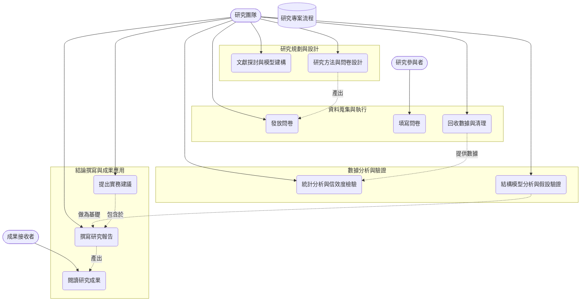

# 第10組 探討Gemini輔助學習之持續使用意圖,以台灣的學生為例
### 功能性需求
---
#### 1. 問卷設計與發放系統 (Questionnaire Design & Distribution System)

 * 說明： 必須建立一個能夠蒐集所有研究變數的結構化問卷。此問卷需要能夠線上填寫與回收，以利於對台灣大學生進行大規模資料蒐集。
 * 具體功能：問卷題目需完整涵蓋「感知有用性」、「感知易用性」、「資訊品質」、「系統品質」、「服務品質」、「持續使用意圖」以及受訪者背景資料（如年級、主修科系、Gemini使用頻率等）。
   系統需提供一個獨立的網頁連結，讓受訪者能方便地透過網路填答。後台需能自動彙整所有回收的問卷數據，並能將其匯出為常見的數據格式（如 .csv 或 .xlsx）以利後續分析。

#### 2. 數據統計與分析功能 (Data Statistical & Analysis Function)

 * 說明： 這是研究的核心，指處理原始數據並驗證研究假設的具體分析流程。
 * 具體功能：必須能夠執行「信度與效度分析」，以確保問卷品質的穩定與準確。必須能夠進行「描述性統計」，以呈現樣本的基本樣貌與特徵。
   必須能夠執行核心的統計模型分析，用以檢驗各個變數之間的因果關係，並驗證研究假設是否成立。

#### 3. 研究結果呈現與報告生成 (Result Presentation & Report Generation)

 * 說明： 研究的最終產出，需將複雜的數據分析結果轉化為易於理解的資訊。
 * 具體功能：能夠將數據分析結果視覺化，例如繪製包含路徑係數與顯著性的研究模型圖。能夠生成清晰的統計表格，如各變數的平均數、標準差、相關係數矩陣等。
   最終產出的報告必須明確條列研究假設的驗證結果（支持或不支持），並根據結果撰寫結論與管理意涵。

---

### 非功能性需求

#### 1. 研究信度與效度 (Reliability & Validity)

 * 信度 (Reliability)： 問卷量表的內部一致性信度必須達到學術上可接受的標準（通常要求 > 0.7）。
 * 效度 (Validity)： 問卷題目必須能準確地測量到我們想要測量的概念（如「感知有用性」），數據分析需證明模型的配適度良好，確保研究結論不是由隨機誤差所造成。

#### 2. 資料隱私與倫理遵循 (Data Privacy & Ethical Compliance)

 * 匿名性： 必須確保問卷填答過程完全匿名，研究團隊無法透過任何方式追溯到特定填答者的個人身份。
 * 知情同意： 在問卷開頭必須清楚說明研究目的、資料用途，並明確告知填答者其數據僅供學術研究使用，以取得他們的知情同意。
 * 資料安全： 蒐集到的原始數據必須妥善保管，防止外洩。

#### 3. 成果可理解性與應用性 (Readability & Applicability)

 * 可理解性： 最終報告的撰寫應避免過度使用艱澀的術語。對於必要的專有名詞，應提供淺顯的解釋。圖表應清晰易讀，能直觀地傳達核心發現。
 * 應用性： 報告中提出的「實務建議」必須具體、中肯且具備可操作性，真正能為AI輔助學習的實踐提供有價值的參考。
---
## 功能分解圖

```mermaid
graph TD;
    classDef level1 fill:#007bff,stroke:#0056b3,stroke-width:2px,color:#fff;
    classDef level2 fill:#e9ecef,stroke:#adb5bd,stroke-width:1px,color:#333;
    classDef level3 fill:#f8f9fa,stroke:#ced4da,stroke-width:1px,color:#333;

    %% Level 0 & 1
    A("Gemini學習輔助使用意圖"):::level1;
    A --> B("1. 研究規劃與設計");
    A --> C("2. 資料蒐集執行");
    A --> D("3. 數據分析與驗證");
    A --> E("4. 結論撰寫與成果發表");

    %% Level 2 - B (研究規劃與設計)
    subgraph " "
        direction LR
        B --> B1("1.1 文獻探討與模型建構");
        B --> B2("1.1 研究方法與問卷設計");
        B --> B3("1.1 前導測試與問卷修訂");
    end

    %% Level 2 - C (資料蒐集執行)
    subgraph " "
        direction LR
        C --> C1("2.2 確認研究對象與抽樣");
        C --> C2("2.2 問卷發放與回收");
        C --> C3("2.2 數據檢核與清理");
    end

    %% Level 2 - D (數據分析與驗證)
    subgraph " "
        direction LR
        D --> D1("3.3 樣本資料描述性統計");
        D --> D2("3.3 信度與效度分析");
        D --> D3("3.3 結構模型分析與假設驗證");
    end

    %% Level 2 - E (結論撰寫與成果發表)
    subgraph " "
        direction LR
        E --> E1("4.4 研究結果詮釋與討論");
        E --> E2("4.4 結論與實務建議");
        E --> E3("4.4 撰寫完整研究報告");
    end

    %% 分類樣式
    class B,C,D,E level2;
    class B1,B2,B3,C1,C2,C3,D1,D2,D3,E1,E2,E3 level3;
```

---
## 使用案例圖

---
## 使用案例說明
  #### 使用案例 1：研究方法與問卷設計
  | **項目** | **內容** |
  | :-- | :-- |
  | 主要角色 | 研究團隊成員 |
  | 目標 | 設計出一份具備信度與效度、能準確衡量各研究變數的結構化問卷。 |
  | 前置條件 | 1. 已完成相關文獻探討。 2. 研究模型與核心變數（如感知有用性、資訊品質等）已確立。|
  | 主要流程 |1. 團隊成員參考國內外成熟量表，草擬問卷初稿。 2. 設計受訪者背景資料題目（如年級、科系、使用頻率）。 3. 邀請小規模目標樣本進行前導測試（Pilot Test）。 4. 根據回饋與預試結果，修訂題項語意與順序。 5. 確認問卷最終版本並定稿 |
  | 替代流程 | 若前導測試顯示部分題意不清或信度不足，團隊需重新修訂問題並再次進行小規模測試。 |
  | 後置條件 | 一份可用於大規模發放的正式線上問卷已準備完成。|

  #### 使用案例 2：發放問卷
  | **項目** | **內容** |
  | :-- | :-- |
  | 主要角色 | 研究團隊成員 |
  | 目標 | 透過線上管道，蒐集到足夠數量且有效的目標樣本（台灣大專院校學生）問卷。 |
  | 前置條件 | 1. 正式問卷已定稿並建立成線上表單（如 Google Forms）。 2. 已確認目標發放管道（如學術社群、大學論壇等）。 |
  | 主要流程 |1. 團隊成員將線上問卷連結發佈至多個目標管道。 2. 定期追蹤並監控後台的問卷回收數量與填答狀況。 3. 持續發佈與提醒，直到回收數量達到預設的樣本目標。 4. 關閉問卷並匯出原始數據。|
  | 替代流程 | 若問卷回收速度不如預期，團隊需增加新的發放管道或適度延長資料蒐集時間。 |
  | 後置條件 | 已成功蒐集到專案所需的原始問卷數據，等待進行下一步的清理與分析。 |

  #### 使用案例 3：統計分析與信效度檢驗
  | **項目** | **內容** |
  | :-- | :-- |
  | 主要角色 | 研究團隊成員（具備統計分析能力者） |
  | 目標 | 驗證問卷數據的信度與效度，並透過統計模型檢驗研究假說是否成立。 |
  | 前置條件 | 1. 已完成問卷數據的蒐集與無效樣本的清理。 2. 已安裝並熟悉操作統計分析軟體 |
  | 主要流程 | 1. 研究成員將清理後的數據匯入統計軟體。 2. 執行信度分析（如 Cronbach's α）與效度分析（如因素分析）。 3. 進行樣本的描述性統計。 4. 使用結構方程模型（SEM）或迴歸分析來驗證研究假說的路徑關係。 5. 系統性地整理與詮釋統計結果。 |
  | 替代流程 | 若數據的信度或效度未達到學術標準，團隊需檢視並考慮刪除不適當的題項，並重新進行分析。 |
  | 後置條件 | 1. 研究假說的驗證結果已產出。 2. 生成了支持研究結論的關鍵數據報表與圖表。 |
  
---
