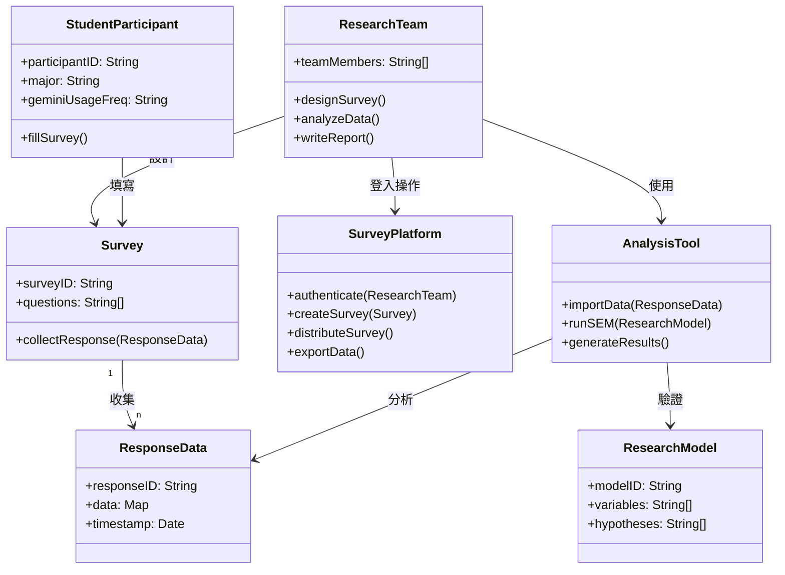
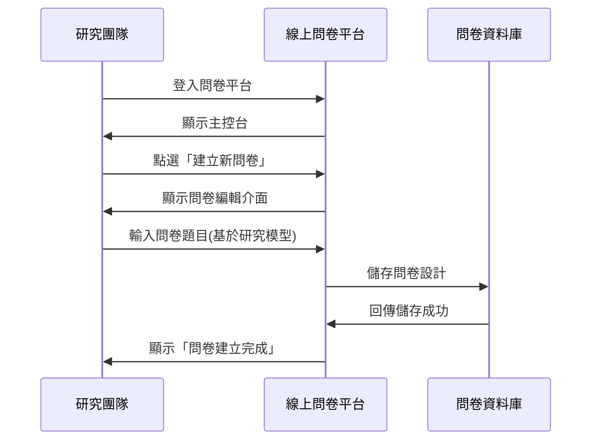
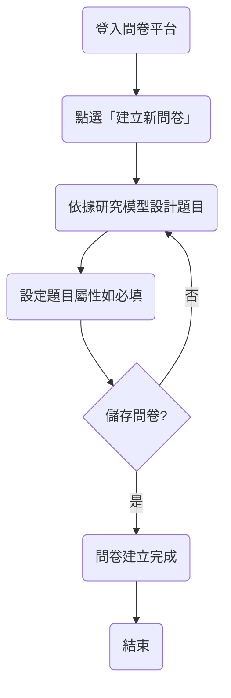
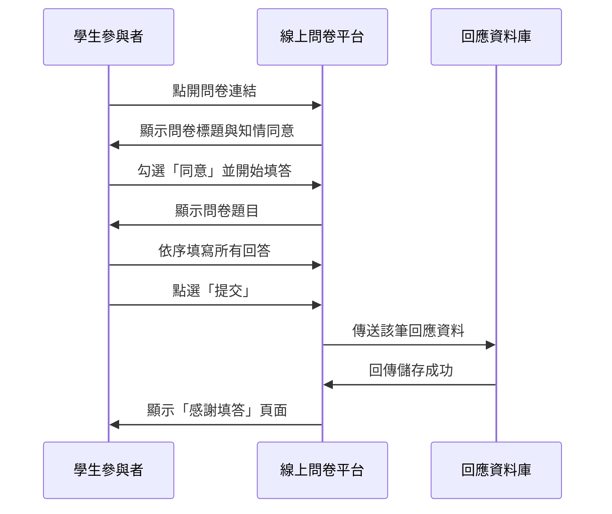
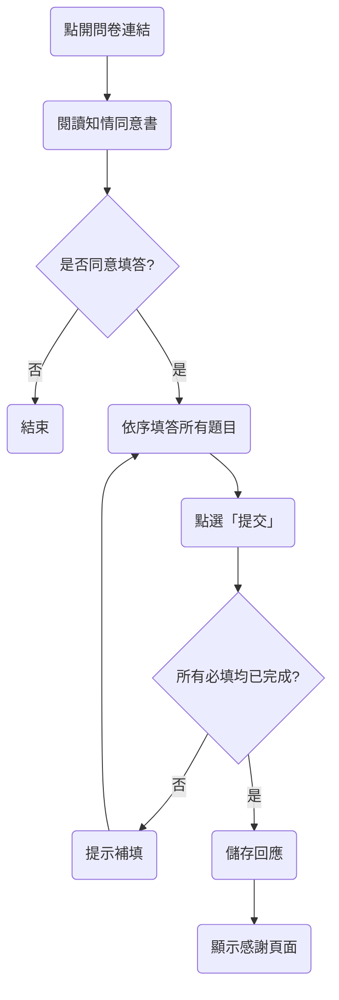
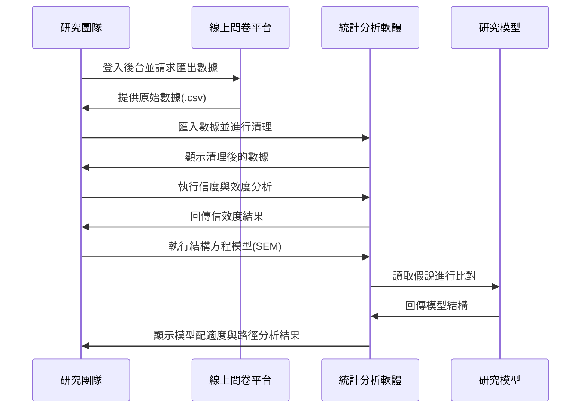
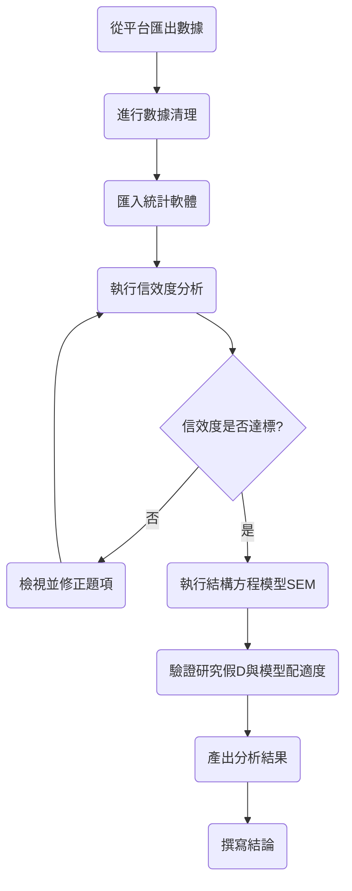

## UML類別圖

```mermaid
classDiagram
    class ResearchTeam {
        +teamMembers: String[]
        +designSurvey()
        +analyzeData()
        +writeReport()
    }
    class StudentParticipant {
        +participantID: String
        +major: String
        +geminiUsageFreq: String
        +fillSurvey()
    }
    class Survey {
        +surveyID: String
        +questions: String[]
        +collectResponse(ResponseData)
    }
    class ResponseData {
        +responseID: String
        +data: Map
        +timestamp: Date
    }
    class SurveyPlatform {
        +authenticate(ResearchTeam)
        +createSurvey(Survey)
        +distributeSurvey()
        +exportData()
    }
    class AnalysisTool {
        +importData(ResponseData)
        +runSEM(ResearchModel)
        +generateResults()
    }
    class ResearchModel {
        +modelID: String
        +variables: String[]
        +hypotheses: String[]
    }
    ResearchTeam --> SurveyPlatform : 登入操作
    ResearchTeam --> Survey : 設計
    ResearchTeam --> AnalysisTool : 使用
    StudentParticipant --> Survey : 填寫
    Survey "1" --> "n" ResponseData : 收集
    AnalysisTool --> ResponseData : 分析
    AnalysisTool --> ResearchModel : 驗證
```
---
## 使用案例1：研究團隊設計與建立問卷

```mermaid
sequenceDiagram
    participant Team as 研究團隊
    participant Platform as 線上問卷平台
    participant SurveyDB as 問卷資料庫

    Team->>Platform: 登入問卷平台
    Platform->>Team: 顯示主控台
    Team->>Platform: 點選「建立新問卷」
    Platform->>Team: 顯示問卷編輯介面
    Team->>Platform: 輸入問卷題目(基於研究模型)
    Platform->>SurveyDB: 儲存問卷設計
    SurveyDB->>Platform: 回傳儲存成功
    Platform->>Team: 顯示「問卷建立完成」
```
### 活動圖

```mermaid
flowchart TD
    A(登入問卷平台) --> B(點選「建立新問卷」)
    B --> C(依據研究模型設計題目)
    C --> D(設定題目屬性如必填)
    D --> E{儲存問卷?}
    E --否--> C
    E --是--> F(問卷建立完成)
    F --> G(結束)
```
---
## 使用案例2：學生參與者填答問卷

```mermaid
sequenceDiagram
    participant Student as 學生參與者
    participant Platform as 線上問卷平台
    participant ResponseDB as 回應資料庫

    Student->>Platform: 點開問卷連結
    Platform->>Student: 顯示問卷標題與知情同意
    Student->>Platform: 勾選「同意」並開始填答
    Platform->>Student: 顯示問卷題目
    Student->>Platform: 依序填寫所有回答
    Student->>Platform: 點選「提交」
    Platform->>ResponseDB: 傳送該筆回應資料
    ResponseDB->>Platform: 回傳儲存成功
    Platform->>Student: 顯示「感謝填答」頁面
```
### 活動圖

```mermaid
flowchart TD
    A(點開問卷連結) --> B(閱讀知情同意書)
    B --> C{是否同意填答?}
    C --否--> D(結束)
    C --是--> E(依序填答所有題目)
    E --> F(點選「提交」)
    F --> G{所有必填均已完成?}
    G --否--> H(提示補填)
    H --> E
    G --是--> I(儲存回應)
    I --> J(顯示感謝頁面)
```
---
## 使用案例3：研究團隊分析數據與驗證模型

```mermaid
sequenceDiagram
    participant Team as 研究團隊
    participant Platform as 線上問卷平台
    participant AnalysisTool as 統計分析軟體
    participant ResearchModel as 研究模型

    Team->>Platform: 登入後台並請求匯出數據
    Platform->>Team: 提供原始數據(.csv)
    Team->>AnalysisTool: 匯入數據並進行清理
    AnalysisTool->>Team: 顯示清理後的數據
    Team->>AnalysisTool: 執行信度與效度分析
    AnalysisTool->>Team: 回傳信效度結果
    Team->>AnalysisTool: 執行結構方程模型(SEM)
    AnalysisTool->>ResearchModel: 讀取假說進行比對
    ResearchModel->>AnalysisTool: 回傳模型結構
    AnalysisTool->>Team: 顯示模型配適度與路徑分析結果
```
### 活動圖

```mermaid
flowchart TD
    A(從平台匯出數據) --> B(進行數據清理)
    B --> C(匯入統計軟體)
    C --> D(執行信效度分析)
    D --> E{信效度是否達標?}
    E --否--> F(檢視並修正題項)
    F --> D
    E --是--> G(執行結構方程模型SEM)
    G --> H(驗證研究假D與模型配適度)
    H --> I(產出分析結果)
    I --> J(撰寫結論)
```
