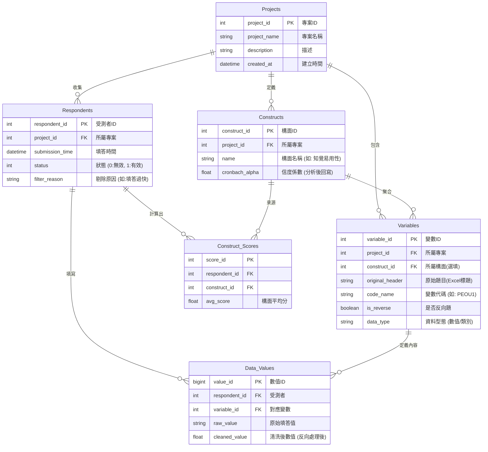

## 實體關係圖（ERD）

```mermaid
erDiagram
    %% 專案管理
    Projects {
        int project_id PK "專案ID"
        string project_name "專案名稱"
        string description "描述"
        datetime created_at "建立時間"
    }

    %% 變數定義 (對應 Excel 的 Header)
    Variables {
        int variable_id PK "變數ID"
        int project_id FK "所屬專案"
        int construct_id FK "所屬構面(選填)"
        string original_header "原始題目(Excel標題)"
        string code_name "變數代碼 (如: PEOU1)"
        boolean is_reverse "是否反向題"
        string data_type "資料型態 (數值/類別)"
    }

    %% 構面定義 (用於信度分析與平均計算)
    Constructs {
        int construct_id PK "構面ID"
        int project_id FK "所屬專案"
        string name "構面名稱 (如: 知覺易用性)"
        float cronbach_alpha "信度係數 (分析後回寫)"
    }

    %% 受測者 (代表 Excel 中的每一列 Row)
    Respondents {
        int respondent_id PK "受測者ID"
        int project_id FK "所屬專案"
        datetime submission_time "填答時間"
        int status "狀態 (0:無效, 1:有效)"
        string filter_reason "剔除原因 (如:填答過快)"
    }

    %% 數據節點 (儲存每一個 Cell 的值)
    Data_Values {
        bigint value_id PK "數值ID"
        int respondent_id FK "受測者"
        int variable_id FK "對應變數"
        string raw_value "原始填答值"
        float cleaned_value "清洗後數值 (反向處理後)"
    }

    %% 構面分數快取 (加速報表顯示)
    Construct_Scores {
        int score_id PK
        int respondent_id FK
        int construct_id FK
        float avg_score "構面平均分"
    }

    %% 關係定義
    Projects ||--o{ Variables : "包含"
    Projects ||--o{ Constructs : "定義"
    Projects ||--o{ Respondents : "收集"
    
    Constructs ||--o{ Variables : "聚合"
    
    Respondents ||--o{ Data_Values : "填寫"
    Respondents ||--o{ Construct_Scores : "計算出"

    Variables ||--o{ Data_Values : "定義內容"
    Constructs ||--o{ Construct_Scores : "來源"
   
```
