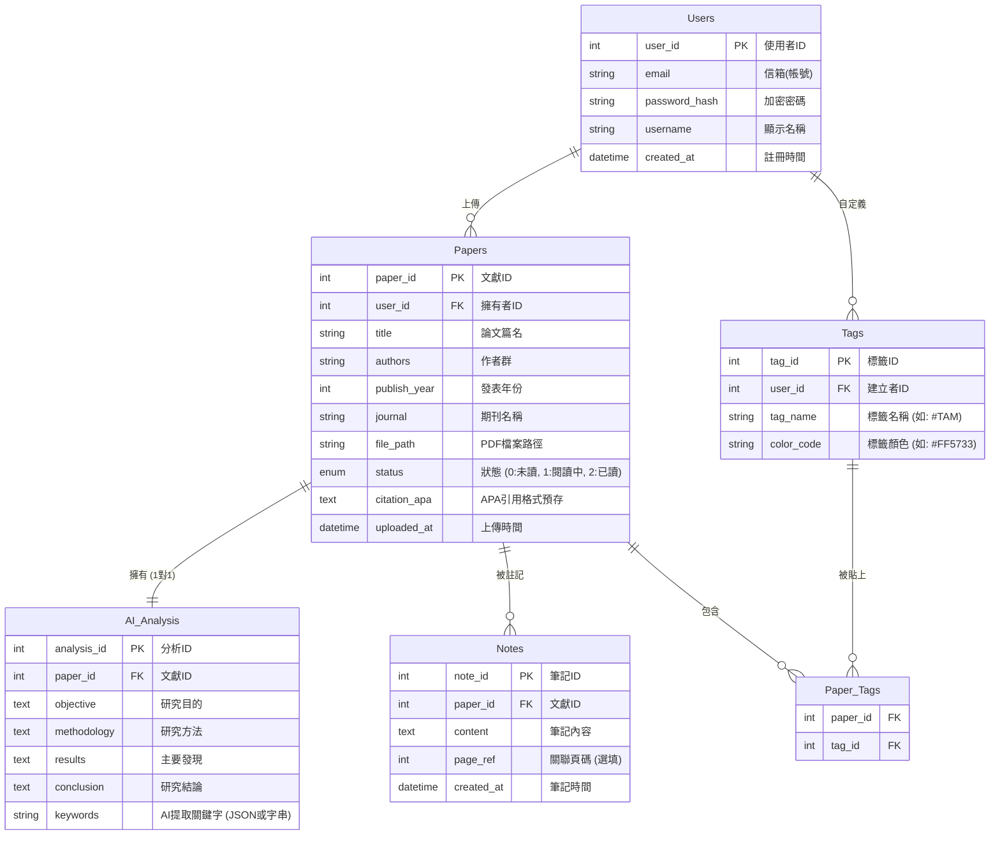

## 實體關係圖（ERD）

```mermaid
erDiagram
    %% 使用者實體
    Users {
        int user_id PK "使用者ID"
        string email "信箱(帳號)"
        string password_hash "加密密碼"
        string username "顯示名稱"
        datetime created_at "註冊時間"
    }

    %% 文獻實體 (核心表)
    Papers {
        int paper_id PK "文獻ID"
        int user_id FK "擁有者ID"
        string title "論文篇名"
        string authors "作者群"
        int publish_year "發表年份"
        string journal "期刊名稱"
        string file_path "PDF檔案路徑"
        enum status "狀態 (0:未讀, 1:閱讀中, 2:已讀)"
        text citation_apa "APA引用格式預存"
        datetime uploaded_at "上傳時間"
    }

    %% AI 分析結果 (將摘要結構化儲存)
    AI_Analysis {
        int analysis_id PK "分析ID"
        int paper_id FK "文獻ID"
        text objective "研究目的"
        text methodology "研究方法"
        text results "主要發現"
        text conclusion "研究結論"
        string keywords "AI提取關鍵字 (JSON或字串)"
    }

    %% 標籤系統 (多對多關係)
    Tags {
        int tag_id PK "標籤ID"
        int user_id FK "建立者ID"
        string tag_name "標籤名稱 (如: #TAM)"
        string color_code "標籤顏色 (如: #FF5733)"
    }

    %% 文獻與標籤的中介表
    Paper_Tags {
        int paper_id FK
        int tag_id FK
    }

    %% 使用者筆記 (獨立表以支援多條筆記)
    Notes {
        int note_id PK "筆記ID"
        int paper_id FK "文獻ID"
        text content "筆記內容"
        int page_ref "關聯頁碼 (選填)"
        datetime created_at "筆記時間"
    }

    %% 關係定義
    Users ||--o{ Papers : "上傳"
    Users ||--o{ Tags : "自定義"
    
    Papers ||--|| AI_Analysis : "擁有 (1對1)"
    Papers ||--o{ Notes : "被註記"
    Papers ||--o{ Paper_Tags : "包含"
    
    Tags ||--o{ Paper_Tags : "被貼上"
   
```
