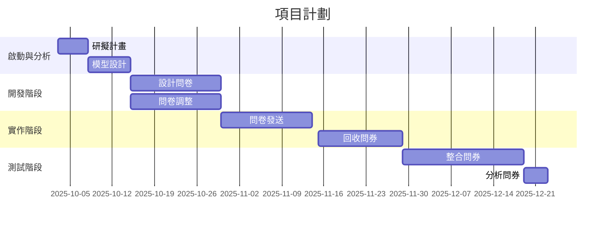
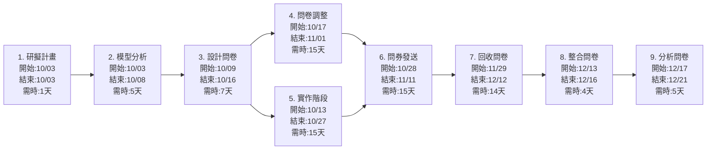

# 第10組
 
## 1.組員任務

| 組員   | 角色 | 任務                                                                 | 預估時間 |
|--------|------|--------------------------------------------------------------------------|----------|
| 陶榮蓁 | 組長 | 問券製作、問卷分析、模型設計 | 4-6 週   | 
| 黃靖凱 | 組員 | 查找資料 | 3-5 週   | 

## 2.甘特圖

專案時程（2025/10/03 至 2025/12/23，約 12 週）。

## 3.PERT/CPM圖

關鍵路徑：1->2->3->4->6->7->8->9
